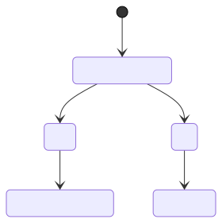

# iotoro API protocol

There are different types of messages:
- Ping / Pong
- Write upstream
- Write downstream
- Read upstream
- Read downstream

## Packet format
|  x   |   x - x+8   |      x+8 - x+8+16     |
|------|-------------|-----------------------|
| Data | device_id   | initialization_vector |

### Data
|  0 - 3  | 4 - 7  |    8-23     |  24 - *   |
|---------|--------|-------------|-----------|
| Version | Action | Payload len |  Content  |

### Content
#### Parameter
|  0-9  |  10  |  11-18  |
|-------|------|---------|
|  name | type |  value  |

## Messages
When a device sends a message to the server, the server responds in the
following way:

### Device -> Server

#### PING
- Version: X
- Action: PING
- Content: []

#### Write upstream
- Version: X
- Action: WRITE_UP
- Content: [`name, type, value`]

#### Read upstream
- Version: X
- Action: READ_UP
- Content: [XXX]

### Server -> Device

#### Pong
- Version: X
- Action: PONG
- Content: []

#### Write downstream
- Version: X
- Action: WRITE_DOWN
- Content: [XXX]

#### WRITE downstream
- Version: X
- Action: READ_DOWN
- Content: [XXX]

## Encryption

### URL endpoint:
`/api/hexified(md5sum(hexified(device_id)))/`

- `device_id` - The device id represented as RAW bytes.
- `hexified` - A string-friendly hex representation where each byte is represented in hex.
- `md5sum` - The md5sum of the input.

### Payload
The payload of a packet is constructed as follows:

1. The version, action and payload length is added to the first x bytes.
2. The data content is appended
3. Pad bytes are appended, since AES requires input to be in block size of X (16 for AES128).
4. The device Id is appended (as raw bytes)
5. Payload is encrypted with AES128
6. The iv used for encryption is appended

`AES128( version + action + len +  content  +  device_id ) + iv`
